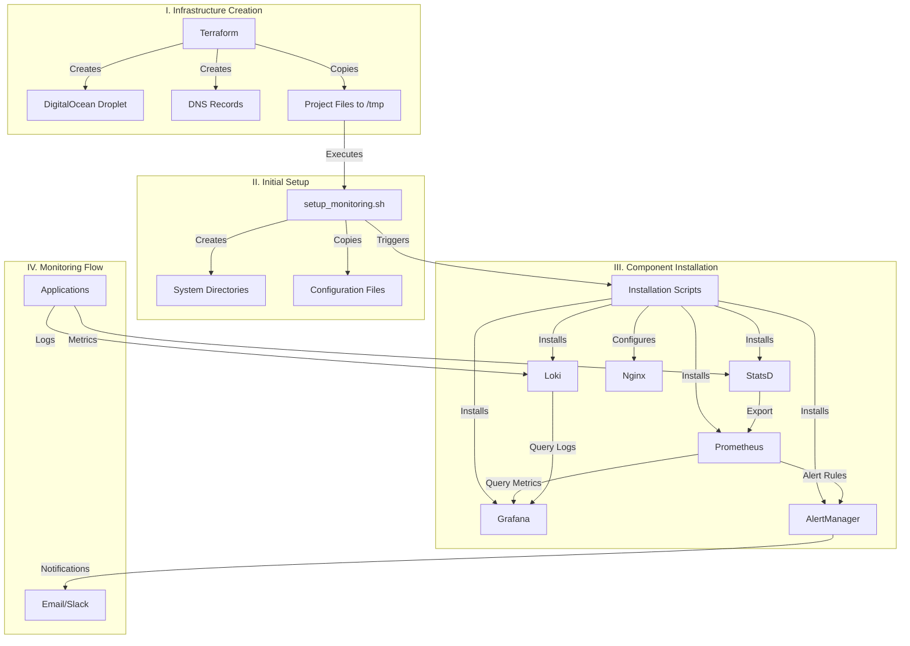

# Monitoring Stack on DigitalOcean

A complete infrastructure-as-code solution for deploying a comprehensive monitoring stack on DigitalOcean using Terraform and automated bash scripts.

## 🏗️ Architecture

This project deploys a full-featured monitoring stack including:

- **Prometheus** - Metrics collection and storage
- **Grafana** - Visualization and dashboards
- **AlertManager** - Alert handling and notifications
- **Loki** - Log aggregation and storage
- **StatsD** - Metrics collection agent
- **Nginx** - Reverse proxy and load balancing

## 📋 Prerequisites

Before you begin, ensure you have the following installed and configured:

- [Terraform](https://www.terraform.io/downloads.html) (>= 1.0)
- [DigitalOcean CLI](https://docs.digitalocean.com/reference/doctl/) (doctl)
- Bash shell environment
- Git

### Required Accounts & Tokens

1. **DigitalOcean Account** with API token
2. **Domain** for DNS configuration (optional but recommended)
3. **Email/Slack** for alerting (configured during setup)

## 🚀 Quick Start

### 1. Clone the Repository

```bash
git clone https://github.com/yourusername/monitoring-stack-digitalocean.git
cd monitoring-stack-digitalocean
```

### 2. Configure Environment Variables

Create a `.env` file

```bash
MONITORING_USERNAME=xxxxx
MONITORING_PASSWORD=xxxxxxx

#Alertmanager details
SMTP_SMARTHOST=xxxxxx
SMTP_FROM=xxxxxxx
SMTP_AUTH_USERNAME=xxxxx
SMTP_AUTH_PASSWORD= xxxxx
ALERT_EMAIL_RECEIVER= xxxxx

DO_API_TOKEN= xxxxxxxxx
```

### 3. Initialize Terraform

```bash
terraform init
```

### 4. Plan and Apply Infrastructure

```bash
# Review the planned changes
terraform plan

# Apply the infrastructure
terraform apply
```

### 5. Access Your Monitoring Stack

After deployment completes, you can access:

- **Grafana**: `https://grafana.domain:3000`
- **Prometheus**: `https://prometheus.domain:9090`
- **AlertManager**: `https://alertmanager.domain:9093`

Default credentials will be provided in the Terraform output.

## 📁 Project Structure

```
monitoring-stack-digitalocean/
├── terraform/                 # Terraform configuration files
│   ├── main.tf               # Main infrastructure definition
│   ├── variables.tf          # Input variables
│   ├── outputs.tf            # Output values
│   └── terraform.tfvars      # variables
├── scripts/                  # Installation and setup scripts
│   ├── setup_monitoring.sh              # Main setup script
│   ├── install-prometheus.sh # Prometheus installation
│   ├── install-grafana.sh    # Grafana installation
│   ├── install-alertmanager.sh # AlertManager installation
│   ├── install-loki.sh       # Loki installation
│   ├── install-statsd.sh     # StatsD installation
│   └── configure-nginx.sh    # Nginx installation
├── configs/                  # Configuration files
│   ├── prometheus/           # Prometheus configurations
│   ├── grafana/              # Grafana configurations
│   ├── alertmanager/         # AlertManager configurations
│   ├── loki/                 # Loki configurations
│   └── nginx/                # Nginx configurations         
└── README.md                 # This file
```

## ⚙️ Configuration

### Terraform Variables

Key variables you can customize in `terraform.tfvars`:

```hcl
# DigitalOcean settings
do_token = "your_digitalocean_token"
region = "nyc1"
droplet_size = "s-2vcpu-4gb"

# Domain settings (optional)
domain = "your-domain.com"
subdomain = "monitoring"

# Monitoring settings
retention_days = 30
alert_email = "admin@your-domain.com"
```

### Component Configuration

Each monitoring component can be configured by editing files in the `configs/` directory:

- **Prometheus**: `configs/prometheus/prometheus.yml`
- **Grafana**: `configs/grafana/grafana.ini`
- **AlertManager**: `configs/alertmanager/alertmanager.yml`
- **Loki**: `configs/loki/loki.yml`

## 🔒 Security Considerations

- All services are configured with authentication
- Firewall rules are applied to restrict access
- SSL/TLS certificates are automatically generated (if domain is provided)
- Sensitive data is stored in environment variables

## 📊 Default Dashboards

The following Grafana dashboards are included:

1. **System Overview** - CPU, Memory, Disk, Network metrics
2. **Application Metrics** - Custom application metrics via StatsD
3. **Log Analysis** - Log aggregation and search via Loki
4. **Alert Status** - AlertManager status and firing alerts

## 🚨 Alerting

AlertManager is configured with the following default alerts:

- High CPU usage (>80% for 5 minutes)
- High memory usage (>90% for 5 minutes)
- Disk space low (<10% remaining)
- Service down (any monitored service)

## 📝 Usage Examples

### Adding Custom Metrics

Send custom metrics to StatsD:

```bash
# Counter
echo "myapp.users.login:1|c" | nc -u localhost 8125

# Gauge
echo "myapp.queue.size:42|g" | nc -u localhost 8125

# Timer
echo "myapp.response.time:320|ms" | nc -u localhost 8125
```

### Querying Logs

Use Loki for log queries in Grafana:

```logql
{job="myapp"} |= "error"
{job="nginx"} | json | status_code >= 400
```

### Custom Prometheus Queries

Example PromQL queries:

```promql
# CPU usage by instance
100 - (avg by (instance) (irate(node_cpu_seconds_total{mode="idle"}[5m])) * 100)

# Memory usage percentage
(1 - (node_memory_MemAvailable_bytes / node_memory_MemTotal_bytes)) * 100
```

## 🔧 Maintenance

### Updating Components

To update any component:

1. Modify the installation script in `scripts/`
2. Run `terraform apply` to update the infrastructure
3. The setup script will handle the updates automatically

### Scaling

To scale the monitoring stack:

1. Update the `droplet_size` variable in `terraform.tfvars`
2. Run `terraform apply`
3. The droplet will be resized automatically

### Backup

Regular backups are configured for:

- Prometheus data (`/var/lib/prometheus`)
- Grafana configuration (`/var/lib/grafana`)
- Configuration files (`/etc/monitoring`)

## 🐛 Troubleshooting

### Common Issues

**Connection Refused**
```bash
# Check if services are running
sudo systemctl status prometheus grafana-server alertmanager loki

# Check firewall rules
sudo ufw status
```

**High Memory Usage**
```bash
# Adjust Prometheus retention
# Edit /etc/prometheus/prometheus.yml
storage.tsdb.retention.time: 15d
```

**DNS Issues**
```bash
# Verify DNS configuration
dig your-domain.com
nslookup monitoring.your-domain.com
```

### Logs Location

- **Prometheus**: `/var/log/prometheus/`
- **Grafana**: `/var/log/grafana/`
- **AlertManager**: `/var/log/alertmanager/`
- **Loki**: `/var/log/loki/`
- **Setup logs**: `/var/log/monitoring-setup.log`

## 🤝 Contributing

1. Fork the repository
2. Create a feature branch (`git checkout -b feature/amazing-feature`)
3. Commit your changes (`git commit -m 'Add amazing feature'`)
4. Push to the branch (`git push origin feature/amazing-feature`)
5. Open a Pull Request

## 📄 License

This project is licensed under the MIT License - see the [LICENSE](LICENSE) file for details.
